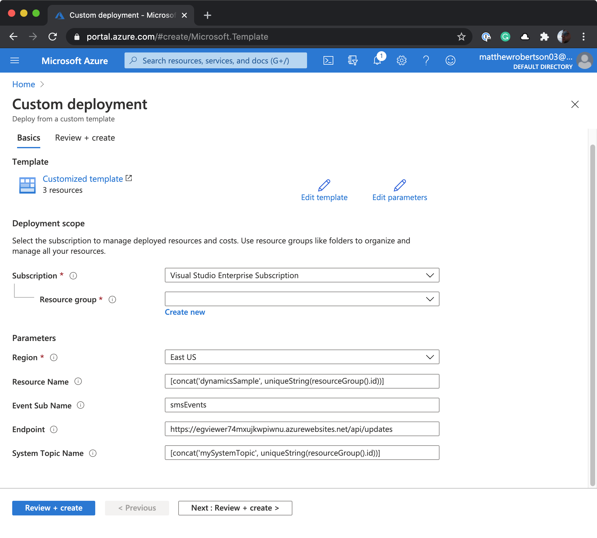
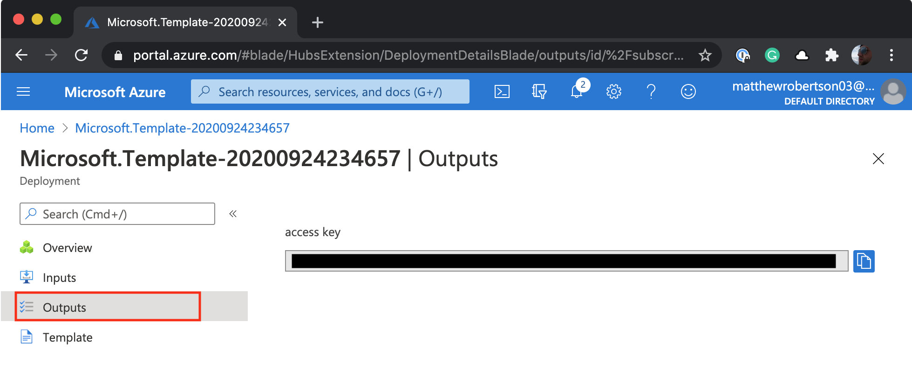

# Azure Communication Services ARM Template

This repository demonstrates use of an ARM template to:

1. Deploy an Azure Communication Services resource
2. Create the Event Grid System topic
3. Create an Event Grid subscription that delivers `Microsoft.Communication.SMSReceived` events `Microsoft.Communication.SMSDeliveryReportReceived` to a webhook
4. Display the Azure Communication Service Connection string

## Using the template

It is trival to construct a link the enables anyone to deploy this template in their own Azure Subscription. To see this in action click the following button:

<a href="https://portal.azure.com/#create/Microsoft.Template/uri/https%3A%2F%2Fraw.githubusercontent.com%2Fmatthewrobertson%2Facs-arm-template%2Fmaster%2Ftemplate.json"></a>

After logging into the Azure portal, you will be taken to a single step deployment editor, that allows you to select a resource group and set a few of the resource attributes. The fields, labels and descriptions can all be customized in the ARM template.



Once the deployment completes, you can open the **Outputs** tab to view the access key that can be used to connect to the Communication Services data plane (i.e. provision phone numbers).



It is also possible to deploy the template via the Azure CLI. The following example creates a resource group, and deploys a template from your local machine:

```bash
az group create --name ExampleGroup --location "West US"
az deployment group create \
  --name ExampleDeployment \
  --resource-group ExampleGroup \
  --template-file template.json \
  --parameters systemTopicName=overriddentopicname
```

## Implementation Details

The entire ARM template is contained in the [template.json](https://github.com/matthewrobertson/acs-arm-template/blob/master/template.json) file. 

The `parameters` section configures the form fields that are presented for the user to customize the resources that will be deployed.

The `resources` section contains the templates for creating the Communication Services resource, Event Grid system topic, and Event Grid subscription.

The `output` section demonstrates use of a function to list the access key of the Communication Services Resource.


## Resources

- [How to guide: Create system topics with ARM templates](https://docs.microsoft.com/en-us/azure/event-grid/create-view-manage-system-topics-arm)
- [ARM templates documentation](https://docs.microsoft.com/en-us/azure/azure-resource-manager/templates/overview)
